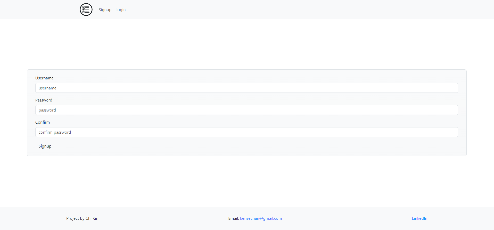
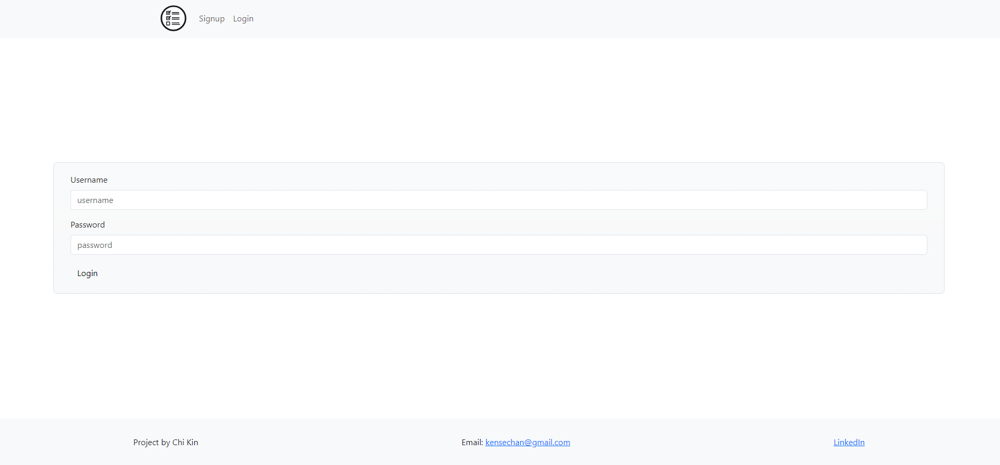
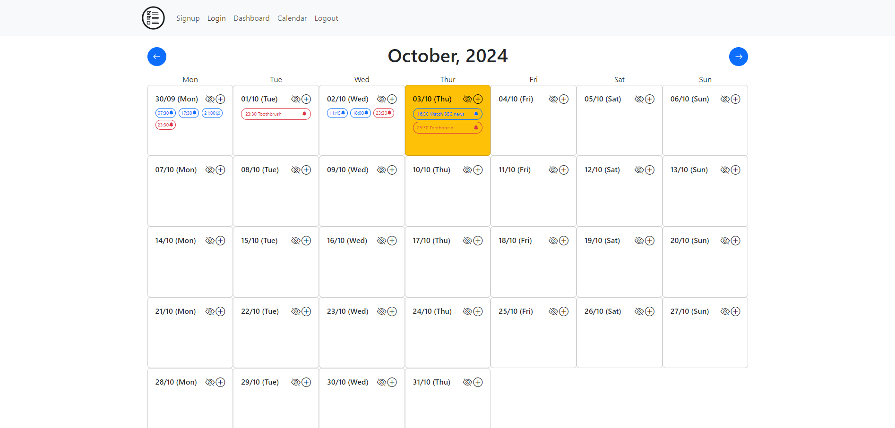
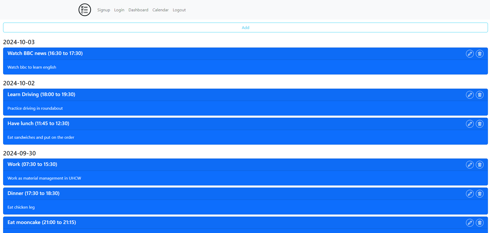

# todolist-with-calendar-and-notification

It is a very simple scheduler app, which help users to manage their activities easily. There is a calendar which can add and display tasks. The app can be installed on window, IOS, and Android. The app can send notifications to users no matter the frontend is running or not.

## Structure of the app

The app consists of 4 pages:

- Signup is the page for new users to signup
  
- Login is the page for users to login
  
- Calendar is the page showing a calendar where users can add and view tasks per day
  
- Dashboard is the page showing the todos and patterns set by the users
  

## Functionalities

- Signup
- Login
- Calendar
- Dashboard

## Data Structure

There are 5 models:

- Todo is a non-repetitive activity. It has title, description, startTime, endTime, createdBy, and dates. The field createdBy is the id of the user who creates the instance of todo. Dates contain the dates on which the todo happens. In this case, the field dates contains only one date.
- Pattern is a repetitive activity, like habits and lessons. Besides the fields of a todo, a pattern has startDate, endDate, and frequency. StartDate and endDate specify the range in which the activity happens. Frequency specifies how often the activity happens (daily or weekly). In the case of Pattern, dates contain all the dates that the activity happens.
- User is created when a user signup. It has username, password, subscription, todos, and patterns. Username and password are the information for login. Subscription is the subscriber id when user subscribe for the notification. Todos and patterns are the array of ids of todos and patterns created by the user.
- Subscriber is created when a user subscribe for the notification. It has the subscription object and a userId, which is the id of the user created the subscription.
- Subscription is the object having endpoint, expirationTime, and keys. Endpoint is the url which send the notification. ExpirationTime is the time when the subscription will be expired. Keys is used to identify the user who sends the notification.

## Responsiveness

## Technologies

- NodeJS
- Express
- MongoDB
- JWT
- React
- React-bootstrap
- Notification API
- Push API
- Service-worker
- Heroku

## Future development
